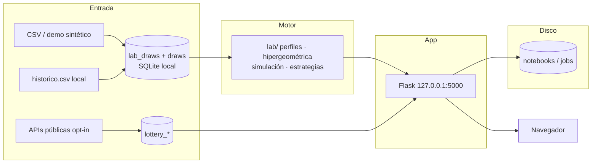
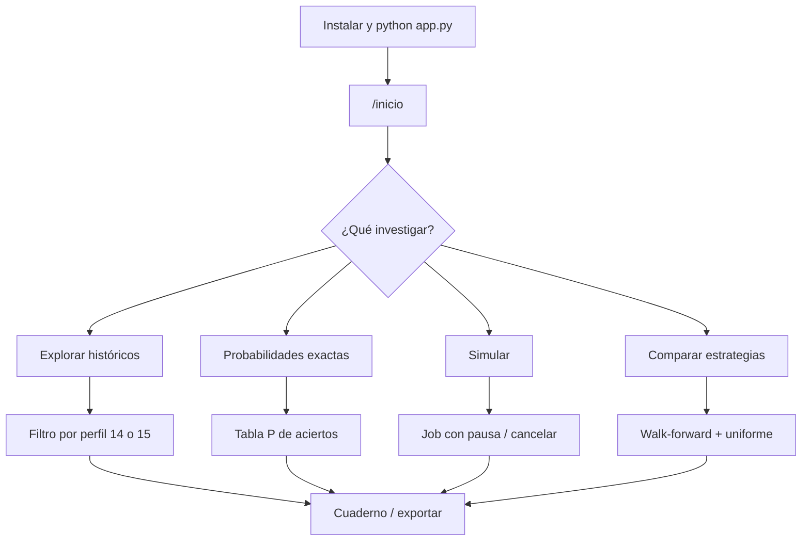
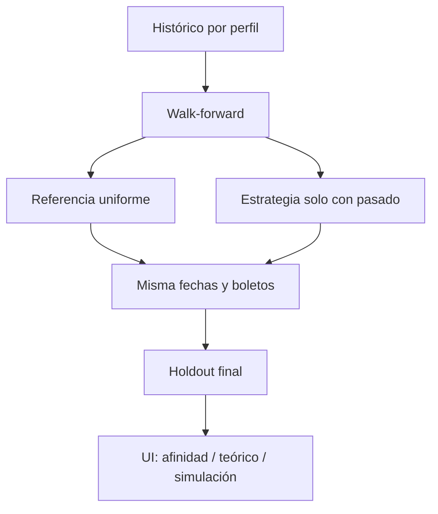

# Kino Lab

Laboratorio **local** para investigar el azar: históricos de Kino (y otras
loterías), probabilidades exactas, simulaciones, comparación de estrategias y
experimentos reproducibles.

Corre en tu máquina (Flask + SQLite en `127.0.0.1`). No pide cuenta, no envía
telemetría y no necesita claves de IA.

**Esto no predice el próximo sorteo.** Si el bombo es uniforme, cada
combinación de Kino 14/25 tiene exactamente la misma probabilidad:
`1 / 4.457.400`. El valor del programa es **entender** qué se puede concluir
—y qué no— a partir de datos, fórmulas y simulaciones.

El repositorio GitHub se mantiene **privado**. Cuando se publique, el mismo
proceso de instalación sirve para cualquiera.

---

## Por qué usar esta herramienta

| Ventaja | Qué ganas |
|---------|-----------|
| **Llegar e instalar** | Un script crea el entorno. Cualquier carpeta, Windows / macOS / Linux. |
| **100 % local** | CSV, SQLite, cuaderno y `.env` no salen del disco. |
| **Honestidad estadística** | Separa histórico, cálculo teórico, simulación y experimento. No vende “chance de ganar”. |
| **Datos trazables** | Cada importación cuenta aceptados, duplicados, conflictos y exclusiones. Los sorteos de 15 bolillas **no** se recortan a 14. |
| **Fórmulas canónicas** | Una sola hipergeométrica. Kino: 4.457.400 combinaciones, esperanza 7,84 aciertos, mínimo 3. |
| **Comparar sin trampa** | Referencia uniforme, mismas fechas y boletos, walk-forward sin filtrar el futuro. |
| **Aprender haciendo** | Desafíos, laboratorio de sesgos sintéticos y gastos ficticios (sin dinero real). |
| **Reproducible** | Semillas, perfiles versionados, cuaderno con ejecuciones que no se sobrescriben. |
| **Offline del núcleo** | Bootstrap y Chart.js van en `static/vendor/`. No hace falta CDN para usar la app. |
| **Sin secretos en el código** | Claves solo en `.env` (gitignorado). Default astro = Santiago centro, no una vivienda. |

Si buscas un sistema para “ganar el Kino”, esto no es eso. Si quieres un
laboratorio claro para explorar el azar, sí.

---

## Requisitos

- Python **3.11+**
- `pip` y `venv`
- Navegador
- ~500 MB libres (dependencias + efemérides Swiss)

No hace falta Docker, GPU ni cuenta en la nube.

---

## Instalación portable

Clona o copia el proyecto a **cualquier ruta**. No uses paths de otra máquina.

### Windows (PowerShell)

```powershell
git clone https://github.com/FernandoLizana/kino-lab.git loteria
cd loteria
powershell -ExecutionPolicy Bypass -File scripts\setup.ps1
.\.venv\Scripts\Activate.ps1
python app.py
```

### macOS / Linux

```bash
git clone https://github.com/FernandoLizana/kino-lab.git loteria
cd loteria
chmod +x scripts/setup.sh
./scripts/setup.sh
source .venv/bin/activate
python app.py
```

### A mano (idéntico resultado)

```bash
python -m venv .venv
# Windows: .\.venv\Scripts\Activate.ps1
# Unix:    source .venv/bin/activate
python -m pip install --upgrade pip
pip install -r requirements.txt
# Windows: copy .env.example .env
# Unix:    cp .env.example .env
python app.py
```

Abre [http://127.0.0.1:5000/inicio](http://127.0.0.1:5000/inicio).

Comprobado en **Windows 10/11 + Python 3.11**. Linux/macOS usan el mismo stack;
no se ejecutaron en esta máquina.

Copia `.env.example` → `.env` y cambia `SECRET_KEY`. Coordenadas astro son
opcionales y deben ser **genéricas** (nunca GPS de una casa).

---

## Recorrido de 2 minutos (sin claves)

1. Inicio → **Ejemplo sintético** (datos inventados, etiquetados).
2. **Probabilidades** → ver `1 / 4.457.400` y la tabla de aciertos.
3. **Explorar** → frecuencias con denominador y sorteos originales.
4. **Simular** → modo rápido (10.000), se puede pausar o cancelar.
5. **Experimentos** → guarda la pregunta y exporta JSON/PDF.

Los CSV de demo viven en `samples/demo/` y `static/demo/`.

---

## Cómo se mueve la información



Nada se publica. El sync remoto es opt-in y solo usa resultados públicos.

---

## Flujo de uso



---

## Evaluación (por qué no “predice”)



Reglas que el código aplica:

1. Histórico ≠ probabilidad del próximo sorteo.
2. Sin reposición, las bolillas del **mismo** sorteo sí dependen.
3. Toda comparación predictiva lleva referencia uniforme.
4. No se usa el futuro para decidir en una fecha pasada.
5. 0 casos en una simulación corta ≠ probabilidad 0.

---

## Mapa de la aplicación

### Laboratorio (nuevo)

| Ruta | Qué hace | Etiqueta |
|------|----------|----------|
| `/inicio` | Inicio guiado + demos | — |
| `/explorar` | Frecuencias, atrasos, sorteos | Datos históricos |
| `/importar` | CSV con preview e informe | Datos históricos |
| `/probabilidades` | Hipergeométrica | Cálculo teórico |
| `/combinaciones` | Boletos válidos y favoritos | Generación |
| `/simular` | Monte Carlo 10k / 100k / máx 1e6 | Simulación |
| `/comparar` | Uniforme vs frecuencia vs fija | Resultado experimental |
| `/modelos` | Fichas transparentes | — |
| `/aprender` | 7 desafíos | — |
| `/sesgos` | Generador sintético | Datos sintéticos |
| `/gastos` | Presupuesto ficticio | Supuesto hipotético |
| `/experimentos` | Cuaderno local | — |
| `/asistente` | Explicaciones sin red | — |
| `/ajustes` | Respaldo, restauración, borrar | — |

### Kino clásico (se conserva)

Dashboard, análisis, colores, puntuar, backtesting, portafolio, resultados,
astro/luna/tarot (experimentales), otras loterías.

### Perfiles de juego

| Slug | Regla | Origen |
|------|-------|--------|
| `kino_moderno` | 14 de 25 | Filas de 14 en `historico.csv` desde 08-01-2006 (**fecha observada**, no oficial) |
| `kino_clasico` | 15 de 25 | Filas de 15 entre 19-09-1990 y 01-01-2006 |
| `demo_6_3` | 3 de 6 | Sintético para enumerar 20 combinaciones |
| `demo_uniforme` | 14 de 25 | Sintético uniforme |

---

## Datos semilla

Al arrancar, si las tablas están vacías:

1. `Draw` (14 bolillas): `data/kino_draws.csv` → `kino.csv` → `historico.csv` (solo filas de 14).
2. `LabDraw`: `historico.csv` completo, **segmentado** por 14 y 15.

| Archivo | Filas | Contenido |
|---------|-------|-----------|
| `historico.csv` | 2.950 | 799×15 + 2.151×14 |
| `samples/demo/kino_moderno_sintetico.csv` | 40 | Inventado, etiquetado |

---

## Estructura

```
app.py                 Flask + rutas Kino clásicas
lab/                   Motor canónico (fórmulas, ingestión, simulación)
services/              Flask: persistencia, jobs, labs, loterías
models/                SQLite: draws, lab_draws, notebooks, jobs…
templates/ + static/   UI (vendor local: Bootstrap 5.3.3, Chart.js 4.4.1)
scripts/setup.ps1|.sh  Instalación de un comando
samples/demo/          CSV sintéticos distribuibles
docs/                  Diagnóstico, matriz M01–M20, seguridad
tests/                 pytest
.env.example           Plantilla sin secretos
```

---

## Tests

```bash
python -m pytest -q
```

Última corrida en este entorno: **42 passed**.

---

## Privacidad

Este repositorio publico nacio con **un solo commit**, sin historial previo.
No incluye credenciales, RUT, GPS de vivienda ni rutas de un usuario.

| Que | Donde | Git |
|-----|-------|-----|
| `SECRET_KEY` | `.env` | No |
| SQLite, uploads, logs | `data/`, `uploads/`, `logs/` | No |
| Resultados oficiales | `historico.csv` | Si (publicos) |
| Demos | `samples/demo/` | Si (sinteticos) |

Servidor: solo `127.0.0.1`. Sin telemetria.

---

## Repositorio

Publico: https://github.com/FernandoLizana/kino-lab

---

## Advertencia

Analizar el pasado no otorga ventaja. Juega solo con dinero que puedas
perder. Esto es un laboratorio educativo, no un consejo de apuestas.
